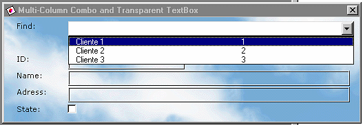



## Using Multi\-Column Combo and Transparent TextBox

### Description

You can use FM20.dll library from Microsoft forms 2.0 for create easily Multi-Column Combo and Transparent Text Box. It is too easy a cool!.

Identical to appearence Microsoft Access forms.

Rate mi code, please!

See you later!
 
### More Info
 
You Should add reference to Microsoft Form 2.o Library (FM20.dll)

Transparent TextBox and MultiColumn Combo Microsoft Access Style.

             |
---                |---
**Submitted On**   |2001-07-23 11:54:00
**By**             |[Oliver Toro](https://github.com/Planet-Source-Code/PSCIndex/blob/master/ByAuthor/oliver-toro.md)
**Level**          |Beginner
**User Rating**    |4.8 (19 globes from 4 users)
**Compatibility**  |VB 5\.0, VB 6\.0, VBA MS Access
**Category**       |[Custom Controls/ Forms/  Menus](https://github.com/Planet-Source-Code/PSCIndex/blob/master/ByCategory/custom-controls-forms-menus__1-4.md)
**World**          |[Visual Basic](https://github.com/Planet-Source-Code/PSCIndex/blob/master/ByWorld/visual-basic.md)
**Archive File**   |[Multi\-Colu233247232001\.zip](https://github.com/Planet-Source-Code/oliver-toro-using-multi-column-combo-and-transparent-textbox__1-25369/archive/master.zip)

